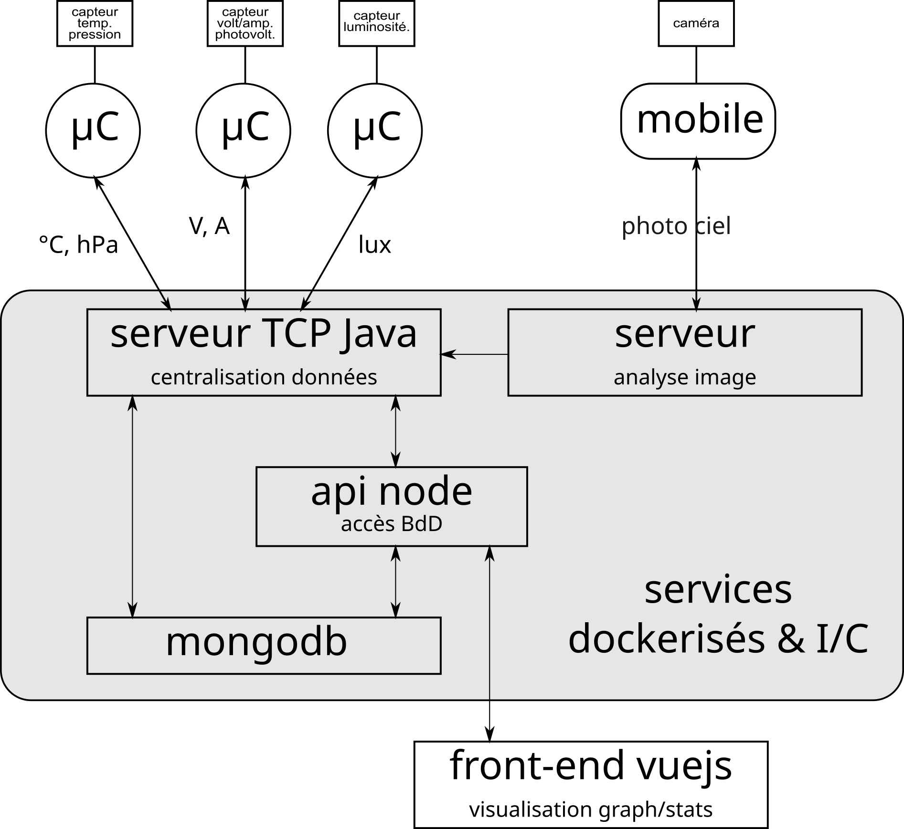
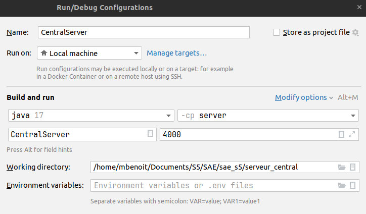
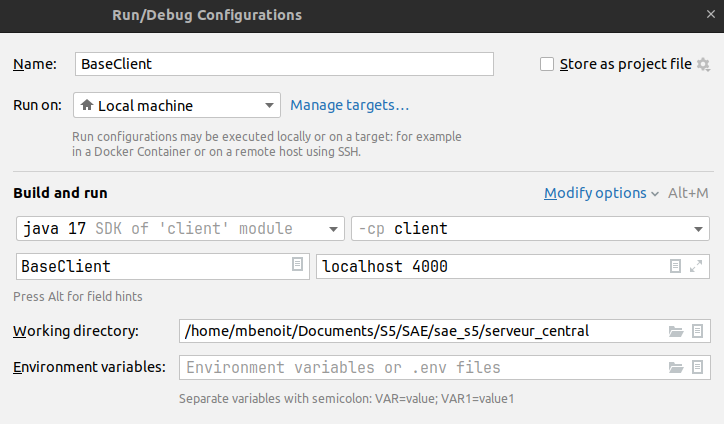

# SAE_S5

Ce projet, développé dans le cadre universitaire, est une application multi-architectures conçue pour évaluer le temps de réaction et d'exécution de personnes lors de divers tests.

**Plus d'instructions [ici](https://cours-info.iut-bm.univ-fcomte.fr/index.php/menu-lpsil/sae-dev-appli-avec-bdd/2505-presentation-de-la-sae)**

## Application mobile
Cette application permet aux utilisateurs de prendre des photos de deux individus et de les envoyer au serveur d'analyse.

Pour accéder à ce serveur, il est essentiel de modifier les paramètres de connexion (adresse et port). De plus, le serveur et le téléphone doivent être sur le même réseau.

## Sketch Arduino
Ce programme permet de réaliser plusieurs tests pour mesurer le temps de réaction et d'exécution du participant.

Les tests disponibles sont :

* **test 1 :** appuyer le plus rapidement possible sur un bouton après l'allumage d'une LED ;
* **test 2 :** similaire au test 1, mais avec un stimulus sonore ;
* **test 3 :** appuyer le plus rapidement possible sur le bouton correspondant au mot affiché (rouge, vert, jaune) ;
* **test 4 :** appuyer le plus rapidement possible sur un bouton après un signal sonore.

## Serveur d'analyse
Ce serveur reçoit une image de l'application mobile et analyse si les individus représentés regardent dans la même direction.

Ensuite, il transmet le résultat au serveur central. Il est donc crucial de configurer correctement les paramètres de communication entre ces deux serveurs.

## Serveur de centralisation
Ce serveur permet de lancer des tests Arduino via le terminal. Les données résultantes de ces tests (temps de réaction et d'exécution), sont transmise à la base de données MongoDB. De plus, les résultats provenant du serveur d'analyse sont également enregistrés dans cette base de données.

## API REST
Nous disposons d'un serveur écrit en Node.js, qui est le lien entre le navigateur et la base de données. 
De plus, il permet aussi d'enregistrer les données reçues du serveur de centralisation dans MongoDB.

En fonction du type de requête et des données associée (objets JSON), le serveur API exécutera certaines instructions pour mettre à jour la base de données et/ou en extraire des informations.

## Frontend
Cette application Vue.js a pour objectif de permettre aux utilisateurs de sélectionner des types de stimuli (sonores ou visuels) et de visualiser les données correspondantes sous forme de graphique. Le composant principal affiche un graphique basé sur les données fournies et offre une interface pour filtrer les données affichées en fonction du type de stimulus sélectionné. Cette fonctionnalité est cruciale pour les utilisateurs souhaitant analyser et comparer différents types de stimuli de manière interactive.

## Docker
Docker permet de lancer le projet sans effectuer toutes les étapes de configuration


## Architecture
Sur la figure ci-dessous, on observe la façon dont chaque partie communique avec les autres.
Les parties représentées dans le cadre gris sont conteneurisées.

<br>

<br>
<br>

## Configuration et installation
Vous devez suivre les étapes de configuration et d'installation dans l'ordre suivant.


### Base de données
Activer le service mongoDB (pour linux) :
```shell
sudo systemctl start mongod
``` 


### API
Voici comment démarrer cette partie l’application :

1. Ouvrir le projet dans vscode : SAE_S5/visualisation/api

2. Ouvrir un terminal et installer les modules : 
```shell
npm i
```

3. Créer un .env dans `SAE_S5/visualisation/api`:
```shell
ACCESS_TOKEN_SECRET = [votre token]
DATABASE_NAME = [nom de la database]
PORT_SERVER = 5000
```
4. Démarrer l'API
```shell
npm start
```
5. Vérifier que l'API tourne en accédant à la swagger : http://localhost:5000/


### Frontend
Voici comment démarrer cette partie l’application :
1. Ouvrir un terminal à la racine du projet et se diriger dans le répertoire frontend.
```shell
cd ./visualisation/frontend/
```

2. Installer les dépendances
```shell
npm i
```

3. Lancer l'interface graphique
```shell
npm run serve
```

4. Ouvrir le navigateur et allez dans http://localhost:8080


### Arduino
1. Ajouter la librairie `grove_4-digit_display` 
    
    - Télécharger au lien suivant : https://www.arduino.cc/reference/en/libraries/tm1637/ 
    
    - Créer un dossier contenant les librairies :
    - Fichier > préférence 
    - Dans la champ localisasion du croquis mettre le chemin du dossier contenant le librairies d'Arduino
    - Déplacer les librairies téléchargées dans le dossier
    
2. Configurations dans l'IDE
    - Sélectionner la carte ESP32 Dev Module
    - Sélectionner le port : 
        - Linux:  `/dev/ttyACM0` (à adapter en fonction du port sur lequel est branché l'arduino)
        - Window: `COM1` (à adapter en fonction du port sur lequel est branché l'arduino)
    - Dans l'onglet gestionnaire de carte à gauche avoir d'installé: 
        - Arduino AVR boards version 1.8.6 
        - ESP32 par Espressif system version 2.0.14
    - Mettre le niveau de baud à 115200
    - Téléverser


### Serveur central
1. Ouvrir le dossier `SAE_S5/serveur_central` dans l'IDE Intellij IDEA

. Créer un `.env` dans `SAE_S5/serveur_central`:
```shell
DATABASE_NAME = [nom de database identique que pour API]
PORT_API = 5000
```
2. Configurations dans l'IDE
    - Sélectionner le SDK :
        - File > project structure
        - Sélectionner le SDK : corretto 17

    - Sélectionner le niveau de langage :
        - File > project structure
        - Language level : default

    - Ajouter les modules server et client :
        - File > project structure > Module
        - Cliquer sur le + > New module > Java
        - Resnseigner name : server (resp client)
        -  Sélctionner le dossier sae_s5/serveur_central/server (resp sae_s5/serveur_central/client)
        - Cliquer sur advanced setting
        - Vérifier le chemin dans content root : sae_s5/serveur_central/client (resp sae_s5/serveur_central/client)

    - Ajouter les librairies
        - File > project structure > Libraries
        - Cliquer sur le + 
        - Sélctionner le dossier sae_s5/serveur_central/lib
        - Ajouter les lib aux modules client et server

    - Modifier la configuration du lanceur pour le server comme dans l'image
    - 

    - Modifier la configuration du lanceur pour le client comme dans l'image
    - 

3. Si vous rencontrez l'erreur : 
```shell
Error opening the serial port: jssc.SerialPortException: Port name - COM; Method name - openPort(); Exception type - Port not found. 
```
Veuillez changer le port dans le fichier `src/server/ArduinoConfig` à la ligne 8

4. Brancher le micro-contrôleur en USB au PC, lancer le server, puis le client via l'IDE, l'expérience est prête à débuter.

### Serveur d'analyse
1. Ouvrir le dossier `SAE_S5/serveur_analyse` dans l'IDE Intellij IDEA

2. Documentation openCV 480 : https://opencv.org/releases/  

3. Ajouter la librairie :
- Project structure > Libraries >`cliquer sur +
- Sélectionner le dossier `SAE_S5/serveur_analyse/lib`

4. Modifier la configuration du lanceur :
 

### Mobile
1. Ouvrir `SAE_S5/ReactiPop` avec Android Studio
2. Connecter le téléphone et l'ordinateur sur le même réseau wifi
3. Dans le fichier `ReactiPop/app/src/main/java/com/example/reactipop/NewActivity.tk `modifier la ligne 46 en reseignant l’adresse IP du`correspondant au Wifi sur lequel les appareils sont connectés

### Docker

Pour utiliser Docker dans l'environnement de développement il suffit d'exécuter les commandes suivantes :
1. Lancer le fichier "docker-compose.yml" qui contient la configuration de chaque partie conteneurisée
```shell
docker compose up -d
```

2. Arrêter et supprimer tous les conteneurs
```shell
docker compose down
```

3. Entrer dans un conteneur
```shell
docker exec -it {nom_du_conteneur} bash
```
