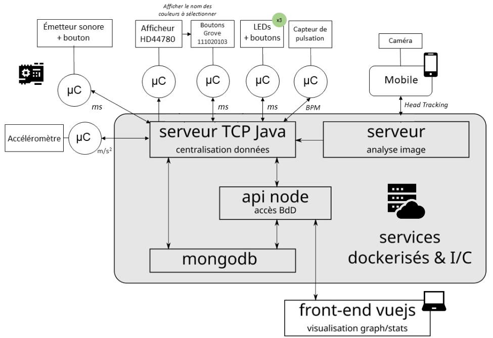

# SAE_S5

Ce projet, développé dans le cadre universitaire, est une application multi-architectures conçue pour évaluer le temps de réaction et d'exécution de personnes lors de divers tests.

**Plus d'instructions [ici](https://cours-info.iut-bm.univ-fcomte.fr/index.php/menu-lpsil/sae-dev-appli-avec-bdd/2505-presentation-de-la-sae)**

## Application mobile
Cette application permet aux utilisateurs de prendre des photos de deux individus et de les envoyer au serveur d'analyse.

Pour accéder à ce serveur, il est essentiel de modifier les paramètres de connexion (adresse et port). De plus, le serveur et le téléphone doivent être sur le même réseau.

## Sketch Arduino
Ce programme permet de réaliser plusieurs tests pour mesurer le temps de réaction et d'exécution du participant.

Les tests disponibles sont :

* **test 1 :** appuyer le plus rapidement possible sur un bouton après l'allumage d'une LED ;
* **test 2 :** similaire au test 1, mais avec un stimulus sonore ;
* **test 3 :** appuyer le plus rapidement possible sur le bouton correspondant au mot affiché (rouge, vert, jaune) ;
* **test 4 :** appuyer le plus rapidement possible sur un bouton après un signal sonore.

## Serveur d'analyse
Ce serveur reçoit une image de l'application mobile et analyse si les individus représentés regardent dans la même direction.

Ensuite, il transmet le résultat au serveur central. Il est donc crucial de configurer correctement les paramètres de communication entre ces deux serveurs.

## Serveur de centralisation
Ce serveur permet de lancer des tests Arduino via le terminal. Les données résultantes de ces tests (temps de réaction et d'exécution), sont transmise à la base de données MongoDB. De plus, les résultats provenant du serveur d'analyse sont également enregistrés dans cette base de données.

## API REST
Nous disposons d'un serveur écrit en Node.js, qui est le lien entre le navigateur et la base de données. 
De plus, il permet aussi d'enregistrer les données reçues du serveur de centralisation dans MongoDB.

En fonction du type de requête et des données associée (objets JSON), le serveur API exécutera certaines instructions pour mettre à jour la base de données et/ou en extraire des informations.

## Frontend
Cette partie visuelle est écrite en JavaScript avec VueJs. Elle communique avec l'API.

Voici comment démarrer cette partie l’application :
1. Ouvrir un terminal à la racine du projet et se diriger dans le répertoire frontend.
```shell
cd ./visualisation/frontend/
```

2. Installer les dépendances
```shell
npm i
```

3. Lancer l'interface graphique
```shell
npm run serve
```

4. Ouvrir le navigateur et allez dans http://localhost:8080

## Docker
Sur la figure ci-dessous, on observe la façon dont chaque partie communique avec les autres.
Les parties représentées dans le cadre gris sont conteneurisées.

<br>

<br>
<br>

Pour utiliser Docker dans l'environnement de développement il suffit d'exécuter les commandes suivantes :
1. Lancer le fichier "docker-compose.yml" qui contient la configuration de chaque partie conteneurisée
```shell
docker compose up -d
```

2. Arrêter et supprimer tous les conteneurs
```shell
docker compose down
```

3. Entrer dans un conteneur
```shell
docker exec -it {nom_du_conteneur} bash
```
